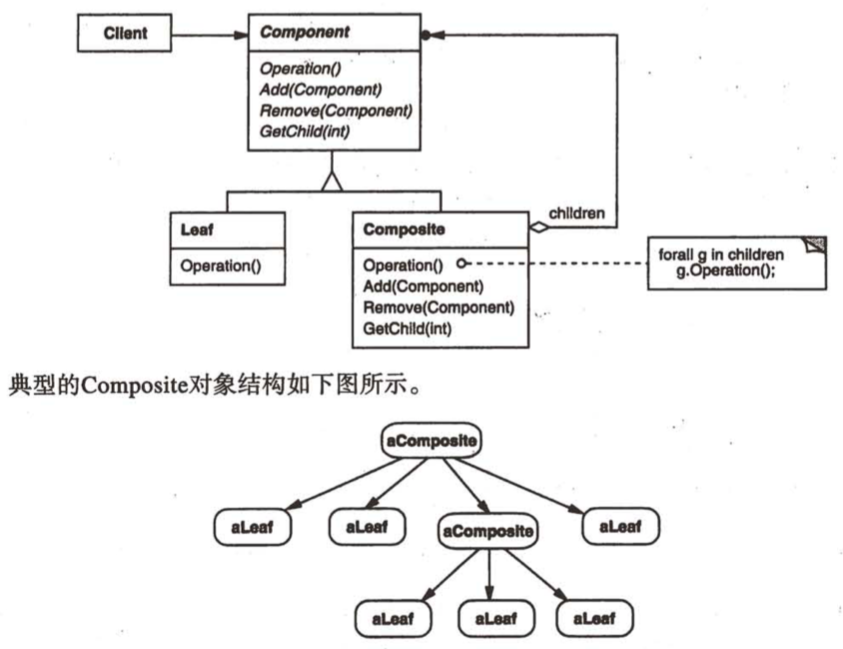
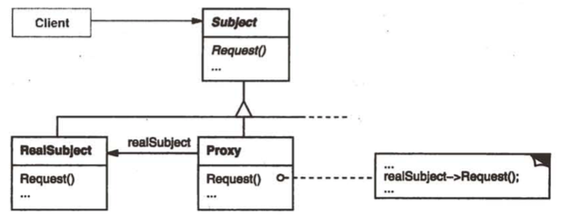

## 设计模式
### Abstract Factory（抽象工厂）
* 把工厂和商品都抽象出来，具体的工厂和商品继承抽象的工厂和商品
* AbstractFactory - 声明一个创建抽象产品对象的操作接口
* ConcreteFactory - 实现创建具体产品对象的操作
* AbstractProduct - 为一类产品对象声明接口
* ConcreteProduct - 定义一个被具体工厂创建的产品对象，实现了AbstractProduct接口

### Builder（生成器）
* 把一个对象展示成不同的形式
* Builder - 为创建一个Product的各个部件指定抽象接口
* ConcreteBuilder - 实现Builder的接口以构造和装配该产品的各个部件；提供一个获取产品的接口

### Factory Method（工厂方法）
* 将哪个product被创建的逻辑抽象出来交给子类来实现
* Product - 定义工厂方法所创建对象的接口
* ConcreteProduct - 实现Product接口
* Creator - 声明工厂方法，该方法返回一个Product类型的对象
* ConcreteCreator - 重新定义工厂方法以返回ConcreteProduct实例

### Prototype（原型）
* 通过克隆来创建对象，开销小
* Prototype - 声明一个克隆自身的接口
* ConcretePrototype - 实现一个克隆自身的操作
* Client - 让一个原型克隆自身从而创建一个对象

### Singleton（单例）
* 保证一个类只有一个实例

### Adapter（适配器）
* 接口转换
* Target - 定义Client使用的与特定领域相关的接口
* Client - 一个符合Target接口的对象协同
* Adaptee - 定义一个已存在的接口，这个接口需要适配
* Adapter - 对Adaptee接口和Target接口进行适配

### Bridge（桥接）
* 把实现又抽象出来了
* Abstraction - 定义了抽象类接口，维护一个指向Implementor类型对象的指针
* RefinedAbstraction - 扩充由Abstraction定义的接口
* Implementor - 定义实现类的接口，该接口不一定与Abstraction接口完全一致；事实上这两个接口可以完全相同。一般来说，Implementor接口仅提供基本操作，而Abstraction则定义了基于这些基本操作的较高层次的操作。
* ConcreteImplementor - 实现Implementor接口并定义它的具体实现

### Composite（组合）
* 将对象组合成树形结构以表示“整体-部分”的层次结构
* Component - 为组合中的对象声明接口；在适当情况下，实现所有类共有接口的缺省行为；声明一个接口用于访问和管理Component的子组件；（可选）在递归结构中定义一个接口，用于访问一个父部件，并在合适的情况下实现它
* Leaf - 表示叶节点对象，没有子节点
* Composite - 定义有子部件的那些部件的行为；存储子部件；在Component接口中实现与子部件有关的操作
* Client - 通过Component接口操作组合部件的对象

### Decorator（装饰）
* 动态地扩展一个对象的功能而不修改类
* Component - 定义一个对象接口，可以给这些对象动态地添加职责
* ConcreteComponent - 定义一个对象，可以给这些对象添加一些职责
* Decorator - 维持一个指向Component对象的指针，并定义一个与Component接口一致的接口
* ConcreteDecorator - 向组件添加职责

### Facade（外观）
* 为子系统定义一组对外的易用的接口

### FlyWeight（享元）
todo
### Proxy（代理）
* 为其它对象提供一种代理以控制对这个对象的访问，比如对象开销太大，可以创建一个虚拟代理；比如为一个对象在不同的地址空间提供局部代表，可以创建远程代理；比如为了控制对对象的访问，可以创建一个保护代理；比如为了管理对象的引用，可以创建智能指引
* Proxy - 保存一个引用使得代理可以访问实体；控制对实体的存取，可以负责创建或删除它；
* Subject - 定义RealSubejct和Proxy的共用接口，这样在任何使用RealSubejct的地方都可以使用Proxy
* RealSubejct - 定义Proxy所代表的实体

### Chain of Responsibility（职责链）
* 自由组合链式调用关系
* Handler - 定义一个处理请求的接口
* ConcreteHandler - 处理它所负责的请求；可访问它的后继者；如果可以处理请求就处理，否则就把请求转发给后继者
* Client - 向链上的具体处理者对象提交请求

### Command（命令）
* Command - 声明执行操作的接口
* ConcreteCommand - 将一个接收者对象绑定到一个动作；调用接收者相应的操作，以实现执行
* Client - 创建一个具体的命令对象并设定它的接受者
* Invoker - 要求该命令执行这个请求
* Receiver - 知道如何实施和执行一个请求相关的操作

### Interpreter（解释器）
TODO
### Mediator（中介者）
TODO
### Memento（备忘录）
TODO
### Observer（观察者）
* Subejct - 目标。知道它的观察者，可以有任意多个观察者观察它，提供注册和删除观察者对象的接口
* Observer - 观察者。为那些在目标发生改变时需获得通知的对象定义一个更新接口
* ConcreteSubject - 具体目标。将有关状态存入各ConcreteObserver对象，当它的状态发生变化时向它的观察者发出通知
* ConcreteObserver - 具体的观察者。维护一个指向ConcreteSubject对象的引用；存储有关的状态，这些状态与目标的状态一致，实现Observer更新接口以使自身状态与目标状态保持一致

### State（状态）
todo
### Strategy（策略）
todo
### Template Method（模板方法）
todo
### Visitor（访问者）
todo